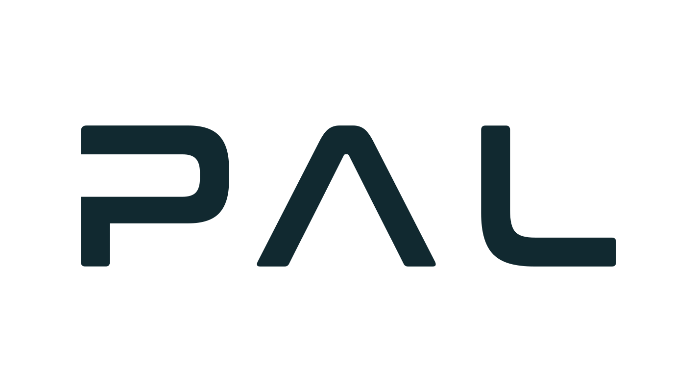

<!--
Copyright 2026 Intelligent Robotics Lab
SPDX-License-Identifier: Apache-2.0
-->

# EasyNav TIAGo Playground

Gazebo simulation (Harmonic or newer) of PAL Robotics' TIAGo in the AWS RoboMaker small house, integrated with EasyNav. The package is self-contained: the robot model, its controllers, the world, the maps and the EasyNav configurations are all included, so you only need this package plus EasyNav (core and plugins) and NavMap.

The simulated TIAGo has its mobile base (pmb2), lifting torso, pan-tilt head with an RGBD camera, 7-DoF arm with the PAL gripper and wrist force/torque sensor, base laser, sonars and IMU. The base drives, and the torso, head, arm and gripper move under ros2_control.

## Build

From the ROS 2 workspace root:

```bash
rosdep install --from-paths src --ignore-src -r -y
colcon build --symlink-install --packages-up-to easynav_playground_tiago
source install/setup.bash
```

## Launch EasyNav

Each `easynav_<config>.launch.yaml` starts Gazebo, TIAGo, EasyNav with that configuration and RViz2:

```bash
ros2 launch easynav_playground_tiago easynav_costmap_rpp.launch.yaml
```

Once RViz2 is up, send a goal with the **2D Goal Pose** tool.

| Launch file | Maps | Localizer | Planner | Controller |
| --- | --- | --- | --- | --- |
| `easynav_costmap_rpp.launch.yaml` | Costmap from `maps/home2.yaml` | Costmap AMCL with the base laser | Costmap | Regulated Pure Pursuit |
| `easynav_navmap_bonxai_amcl.launch.yaml` | NavMap `maps/home2_20cm.navmap` and Bonxai `maps/house.pcd` | NavMap AMCL against the Bonxai map, with the base laser and the head camera | NavMap A* | Regulated Pure Pursuit |

The parameters are in `params/costmap.rpp.params.yaml` and `params/navmap.bonxai.amcl.params.yaml`.

### Launch arguments

| Argument | Default | Description |
| --- | --- | --- |
| `params_file` | Per launch file | EasyNav parameters file |
| `rviz_config` | Per launch file | RViz2 configuration file |
| `gui` | `true` | Set to `false` to run Gazebo headless |
| `rviz` | `true` | Set to `false` to skip RViz2 |

For example, to run headless with your own parameters:

```bash
ros2 launch easynav_playground_tiago easynav_costmap_rpp.launch.yaml gui:=false params_file:=/path/to/my.params.yaml
```

### Notes for other configurations

- TIAGo's base laser is 0.095 m above the floor. EasyNav's localizers and obstacle filters drop points below `min_height` (0.1 m by default) as floor hits, so these configurations set `min_height: 0.05`. Do the same in your own parameters, or the laser is ignored.
- The base takes `geometry_msgs/TwistStamped`, so EasyNav runs with `use_cmd_vel_stamped: true`, and the launch files remap `cmd_vel_stamped` to `/mobile_base_controller/cmd_vel` and `odom` to `/mobile_base_controller/odom`.

## Simulation only

To run Gazebo and TIAGo without EasyNav or RViz2:

```bash
ros2 launch easynav_playground_tiago gazebo_sim.launch.yaml
```

`tiago.launch.yaml` spawns TIAGo in a running simulation (`x`, `y`, `z`, `Y` set the pose). The arm starts tucked, in PAL's `home` posture.

### Topics

| Topic | Type | Content |
| --- | --- | --- |
| `/scan_raw` | `sensor_msgs/LaserScan` | Base laser (SICK TIM571) |
| `/scan_raw/points` | `sensor_msgs/PointCloud2` | Base laser, as a cloud |
| `/sonar_base` | `sensor_msgs/LaserScan` | Base sonars |
| `/head_front_camera/rgb/image_raw`, `.../rgb/camera_info` | `sensor_msgs/Image`, `CameraInfo` | Head camera (Orbbec Astra), color |
| `/head_front_camera/depth_registered/image_raw`, `.../points` | `sensor_msgs/Image`, `PointCloud2` | Head camera, depth |
| `/imu_sensor_broadcaster/imu` | `sensor_msgs/Imu` | Base IMU |
| `/ft_sensor_controller/wrench` | `geometry_msgs/WrenchStamped` | Wrist force/torque sensor |
| `/mobile_base_controller/odom` | `nav_msgs/Odometry` | Wheel odometry (also the `odom` → `base_footprint` TF) |
| `/joint_states`, `/tf`, `/tf_static` | | Joints and TF |

Gazebo publishes every message of the RGBD camera with the same frame, `head_front_camera_rgb_frame` (x forward), which is right for the point cloud. To project images with `camera_info`, use the optical frame `head_front_camera_rgb_optical_frame`.

### Moving the robot

The base listens on `/mobile_base_controller/cmd_vel` (`geometry_msgs/TwistStamped`), for instance with the keyboard:

```bash
ros2 run teleop_twist_keyboard teleop_twist_keyboard --ros-args -p stamped:=true -r cmd_vel:=/mobile_base_controller/cmd_vel
```

Without commands, the base controller warns once a second that it is braking ("Velocity command timed out"); this is expected.

The torso, head, arm and gripper have `joint_trajectory_controller`s: `torso_controller`, `head_controller`, `arm_controller` and `gripper_controller`. Each takes `FollowJointTrajectory` goals on `<controller>/follow_joint_trajectory`, or a trajectory on `<controller>/joint_trajectory`. For example, to look down:

```bash
ros2 topic pub --once /head_controller/joint_trajectory trajectory_msgs/msg/JointTrajectory \
  "{joint_names: [head_1_joint, head_2_joint], points: [{positions: [0.0, -0.6], time_from_start: {sec: 1}}]}"
```

## Building the maps

The costmap (`maps/home2.yaml`, 5 cm) is the house map shared with `easynav_playground_kobuki`. The other two maps were generated with NavMap's `navmap_tools`:

1. `home2_20cm.navmap`, the flat NavMap: the costmap resampled to 20 cm cells, which keeps the NavMap filters and the AMCL within their cycles.

   ```bash
   ros2 run navmap_tools navmap_resample maps/home2.yaml maps/home2_20cm.navmap 0.2
   ```

2. `house.pcd`, the Bonxai 3D map: `navmap_map_builder` teleports TIAGo through the free space of the house and puts together the head camera's and the laser's clouds at the ground-truth poses, turning to 8 headings at each position (the camera's field of view is narrow). With the simulation up and TIAGo looking down, so that the camera sees the floor and the low obstacles near the robot:

   ```bash
   ros2 launch easynav_playground_tiago gazebo_sim.launch.yaml gui:=false
   ros2 topic pub --once /head_controller/joint_trajectory trajectory_msgs/msg/JointTrajectory \
     "{joint_names: [head_1_joint, head_2_joint], points: [{positions: [0.0, -0.6], time_from_start: {sec: 1}}]}"
   ros2 run navmap_tools navmap_map_builder /tmp/house --world default --model tiago \
     --cloud-topic /head_front_camera/depth_registered/points /scan_raw/points \
     --headings 8 --clearance 0.6 --robot-cut 0.6 --spawn-z 0.05
   ```

   Then copy `/tmp/house.pcd` to `maps/`.

## Package layout

| Directory | Contents |
| --- | --- |
| `launch/` | Launch files, in YAML |
| `params/` | EasyNav parameters, one file per configuration |
| `maps/` | Maps: `home2.yaml` (costmap), `home2_20cm.navmap` (NavMap) and `house.pcd` (Bonxai) |
| `rviz/` | RViz2 configurations |
| `config/` | ros2_control controllers (`tiago_controllers.yaml`) and ROS–Gazebo bridge topics |
| `urdf/`, `meshes/` | TIAGo model |
| `worlds/`, `models/`, `photos/` | Small house world |
| `doc/` | PAL Robotics logo |

## The TIAGo model

`urdf/tiago.urdf.xacro` is PAL's TIAGo description expanded once with PAL's default configuration: base `pmb2`, arm `tiago-arm` with wrist `wrist-2010`, force/torque sensor `schunk-ft`, end effector `pal-gripper`, laser `sick-571` and camera `orbbec-astra`. It was expanded from the Gazebo Harmonic ports of PAL's packages ([Tiago-Harmonic](https://github.com/Tiago-Harmonic): `tiago_robot` 29211f4, `pmb2_robot` a9c09d2, `pal_gripper` b6eec0f), and only the meshes it uses were copied. The controller values come from PAL's `tiago_controller_configuration`, `pmb2_controller_configuration` and `pal_gripper_controller_configuration`, and the bridge topics from `tiago_bringup`.

Changes from PAL's model, for this simulation:

- The meshes and the controllers file point to this package.
- The head camera has a `gz_frame_id`: without it, its point cloud carried Gazebo's internal sensor name as frame.
- The wheels' velocity command limit is the wheel joint's (10.15 rad/s, 1 m/s) instead of 1 rad/s (0.1 m/s), which made the base crawl.
- The arm and torso start in PAL's `home` posture (`initial_value` in ros2_control), instead of tucking the arm with play_motion2 at startup.

## Authors and licensing

This package was developed by Francisco Martín Rico at the [Intelligent Robotics Lab](https://intelligentroboticslab.gsyc.urjc.es/) (Universidad Rey Juan Carlos), and is licensed under Apache-2.0; see [LICENSE](./LICENSE).

It includes third-party work under its own copyright and licenses:

- **The TIAGo robot model** (`urdf/`, `meshes/`) and the values of its controllers and bridge (`config/`) are the work of [PAL Robotics](https://pal-robotics.com/): Copyright (c) 2022-2024 PAL Robotics S.L. All rights reserved. They are licensed under the Apache License 2.0 (see [LICENSE](./LICENSE)), and come from PAL's [tiago_robot](https://github.com/pal-robotics/tiago_robot), [pmb2_robot](https://github.com/pal-robotics/pmb2_robot) and [pal_gripper](https://github.com/pal-robotics/pal_gripper), through their Gazebo Harmonic ports at [Tiago-Harmonic](https://github.com/Tiago-Harmonic). TIAGo is a robot by PAL Robotics.
- **The small house world** (`worlds/`, `models/`, `photos/`) comes from [aws-robomaker-small-house-world](https://github.com/IntelligentRoboticsLabs/aws-robomaker-small-house-world) (`ros2` branch), under the MIT No Attribution license; see [models/LICENSE](./models/LICENSE).

The PAL Robotics logo below is PAL Robotics' own, used as published in its [brand guidelines](https://pal-robotics.com/es/guia-marca-logotipo/), unmodified.

<p align="center">
  <a href="https://pal-robotics.com/">
    <picture>
      <source media="(prefers-color-scheme: dark)" srcset="doc/pal_logo_white.svg">
      
    </picture>
  </a>
</p>
